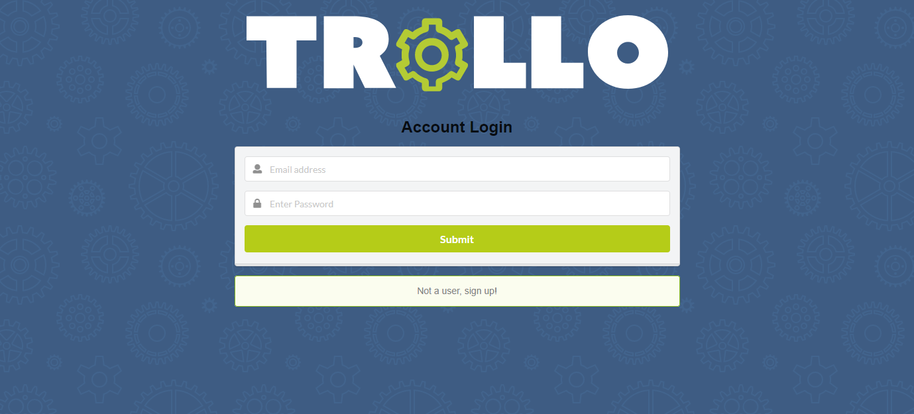

# Trollo App 
This app will allow users manage working in a group remotely more easily.  A member of the team will be able to assign tasks to themselves or other members and label each task as "to-do," "in progress," and "completed."

# Contributers
@rwilliamsIII @kristincenters @iean-hennig @nmonsivais

# Technology
HTML, CSS, ES6, Node.JS, Github, Heroku, ReactJS, Express, React-Bootstrap/Semantic UI, React-Grid-System, Axios, MongoDB/Mongoose, Passport/Bcrypt/JWT

# Heroku Link
[Heroku Live App](https://whispering-waters-86023.herokuapp.com/dashboard)

# Application Demo

# Contact

[Robert Williams](https://rwilliamsiii.github.io/Portfolio/) |

[Kristin Centers](https://kristincenters.github.io/) |

[Iean Hennig](https://iean-hennig.github.io/myPortfolio/) |

[Noe Monsivais](https://nmonsivais.github.io/) |
